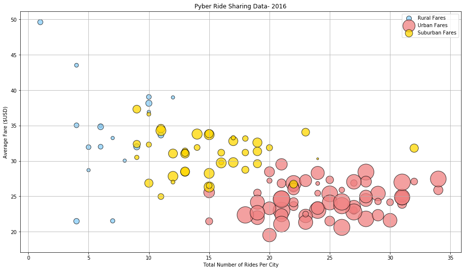
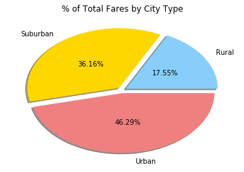
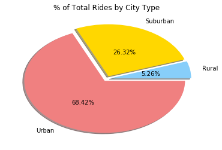
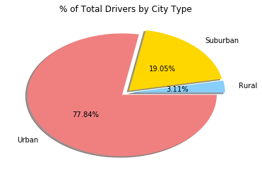

```python
#Observed Trends:
#1 - Pyber fares in rural areas tend to be more expensive, because there is a shorter supply of drivers.
#2 - In urban areas, distances tend to be shorter, so fares are cheaper, and there more drivers available.
#3 - Pyber is most popular in urban areas where there are more places to go and things to do, and supply and demand are both higher.
```


```python
#Dependencies
import matplotlib.pyplot as plt
import seaborn as sns
import numpy as np
import pandas as pd

#Load CSVs
raw_ride_data_df = pd.read_csv("Resources/raw_data/ride_data.csv")
raw_city_data_df = pd.read_csv("Resources/raw_data/city_data.csv")
```


```python
#FINALLY fixed the incredibly sneaky and frustrating duplicate Port James issue
city_data_df = raw_city_data_df.groupby(["city","type"])["driver_count"].sum().reset_index()
```


```python
city_data_df = city_data_df.set_index("city")
```


```python
ride_data_df = raw_ride_data_df
```


```python
fare_by_city_df = ride_data_df.set_index("city").groupby(["city"]).mean()
fare_by_city_df = round(fare_by_city_df.drop(["ride_id"],1),2)
```


```python
#ride count by city
ride_data_by_city_df = ride_data_df.set_index("city").groupby(["city"]).count()
ride_data_by_city_df.columns=[["ride_count", "del", "del"]]
ride_counts_by_city_df=ride_data_by_city_df["ride_count"]
```


```python
#add ride count to city data, merging to data frame
city_ride_merge = pd.merge(city_data_df,ride_counts_by_city_df,how="outer",left_index=True,right_index=True)
#add average fare to city data, merging to new data frame
df = pd.merge(city_ride_merge,fare_by_city_df,how="outer",left_index=True,right_index=True).reset_index()
df.columns = ["City","Type","Drivers","Rides","Fares"]
df["Rides"].sum() #we finally have the same number as length of ride_data- 2375. all are accounted for.
df.head()
```


<div>
<style scoped>
    .dataframe tbody tr th:only-of-type {
        vertical-align: middle;
    }

    .dataframe tbody tr th {
        vertical-align: top;
    }

    .dataframe thead th {
        text-align: right;
    }
</style>
<table border="1" class="dataframe">
  <thead>
    <tr style="text-align: right;">
      <th></th>
      <th>City</th>
      <th>Type</th>
      <th>Drivers</th>
      <th>Rides</th>
      <th>Fares</th>
    </tr>
  </thead>
  <tbody>
    <tr>
      <th>0</th>
      <td>Alvarezhaven</td>
      <td>Urban</td>
      <td>21</td>
      <td>31</td>
      <td>23.93</td>
    </tr>
    <tr>
      <th>1</th>
      <td>Alyssaberg</td>
      <td>Urban</td>
      <td>67</td>
      <td>26</td>
      <td>20.61</td>
    </tr>
    <tr>
      <th>2</th>
      <td>Anitamouth</td>
      <td>Suburban</td>
      <td>16</td>
      <td>9</td>
      <td>37.32</td>
    </tr>
    <tr>
      <th>3</th>
      <td>Antoniomouth</td>
      <td>Urban</td>
      <td>21</td>
      <td>22</td>
      <td>23.62</td>
    </tr>
    <tr>
      <th>4</th>
      <td>Aprilchester</td>
      <td>Urban</td>
      <td>49</td>
      <td>19</td>
      <td>21.98</td>
    </tr>
  </tbody>
</table>
</div>


```python
urban_df = df.loc[df["Type"]=="Urban"]
suburban_df = df.loc[df["Type"]=="Suburban"]
rural_df = df.loc[df["Type"]=="Rural"]
```


```python
plt.figure(figsize=(16,9))
plt.scatter(rural_df["Rides"], rural_df["Fares"], s=rural_df["Drivers"]*16, edgecolors="black", c="lightskyblue", alpha = .75)
plt.scatter(urban_df["Rides"], urban_df["Fares"], s=urban_df["Drivers"]*16, edgecolors="black", c="lightcoral", alpha = .75)
plt.scatter(suburban_df["Rides"], suburban_df["Fares"], s=suburban_df["Drivers"]*16, edgecolors="black", c="gold", alpha = .75)
plt.title("Pyber Ride Sharing Data- 2016")
plt.xlabel("Total Number of Rides Per City")
plt.ylabel("Average Fare ($USD)")
plt.grid()
handles=["Rural Fares","Urban Fares","Suburban Fares"]
plt.legend(handles)
plt.show()
```





```python
plt.pie([urban_df["Fares"].sum(),suburban_df["Fares"].sum(),rural_df["Fares"].sum()],
        colors=["lightcoral","gold","lightskyblue"], autopct='%1.2f%%', pctdistance=.5, labeldistance=1.15, 
        shadow=True,counterclock=False, explode=(.05,.05,.05), labels=["Urban","Suburban","Rural"])
plt.title("% of Total Fares by City Type")
plt.show()
```





```python
plt.pie([urban_df["Rides"].sum(),suburban_df["Rides"].sum(),rural_df["Rides"].sum()],
        colors=["lightcoral","gold","lightskyblue"], autopct='%1.2f%%', pctdistance=.5, labeldistance=1.15, 
        shadow=True,counterclock=False, explode=(.05,.05,.05), labels=["Urban","Suburban","Rural"])
plt.title("% of Total Rides by City Type")
plt.show()
```





```python
plt.pie([urban_df["Drivers"].sum(),suburban_df["Drivers"].sum(),rural_df["Drivers"].sum()],
        colors=["lightcoral","gold","lightskyblue"], autopct='%1.2f%%', pctdistance=.5, labeldistance=1.15, 
        shadow=True,counterclock=False, explode=(.05,.05,.05), labels=["Urban","Suburban","Rural"])
plt.title("% of Total Drivers by City Type")
plt.show()
```




